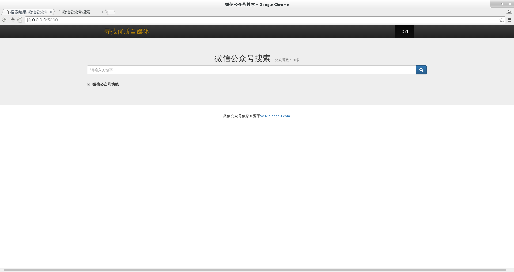
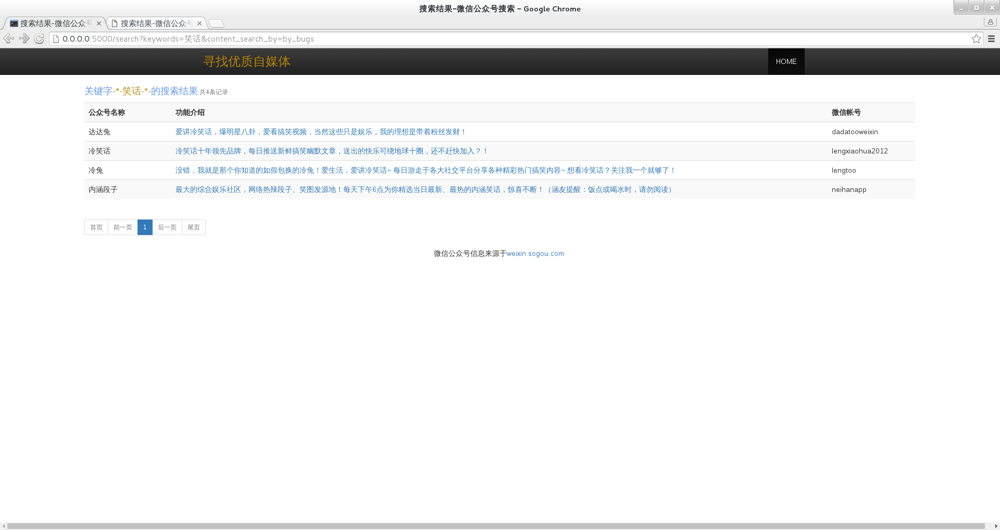

### 1.安装相关组件
+ python 2.7和pip
+ mongodb
+ scrapy
+ flask
+ pymongo
+ APScheduler

### 2.启动爬虫和web(log日志记录)
+ 启动命令: sh start.sh

+#!/bin/bash

+service mongod start &

+cd bin
+python control.py main.py start &

+cd ../flask
+python app.py

### 3.todolist
+ #1 按照公众号影响力排序
+ #2 推荐功能
+ #3 收藏加Tag

